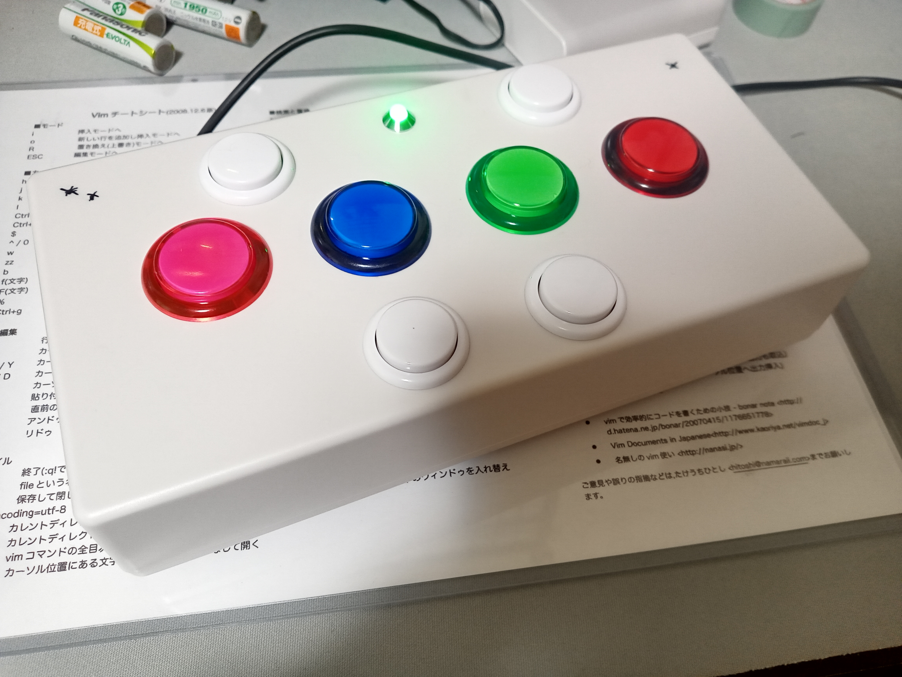

# CH32V-FNF-Controller
## 概要

CH32V003F4P6を使用しFridayNightFunkinの専用コントローラーを作成しました。
## パーツ
- CH32V003F4P6 * 1
- CH9329 * 1
- ボタン * 8 or 9
- LED * 1
- XHコネクタ * 9
- USB Type-Cコネクタ * 1
- リセッタブルヒューズ 500mA * 1
- コンデンサ 0.1μF * 3
- 抵抗
  - 5k1 * 1
  - 10k * 7
  - 200 * 1
## マイコン
CH32V003F4P6用に設計しており、MounRiverを使用しています。  
他のマイコンを使用する場合、mainファイルの書き換えやPCBデータの書き換えが必要になる場合があります。
## PCB
ソフトウェアはKiCadを使用しています。  
outputフォルダに既にガーバーデータを出力したファイルを格納しているのでそこから基盤を作成しても構いません。しかし、初めて基盤を作成したので不具合がある可能性があります。  
スペース用のボタンは2つ使えるようにしていますが、1つのみでも使えるようにしています。
